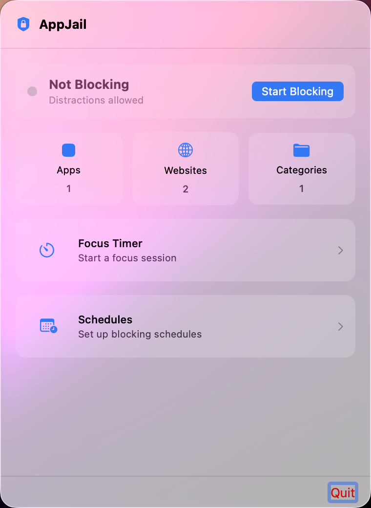
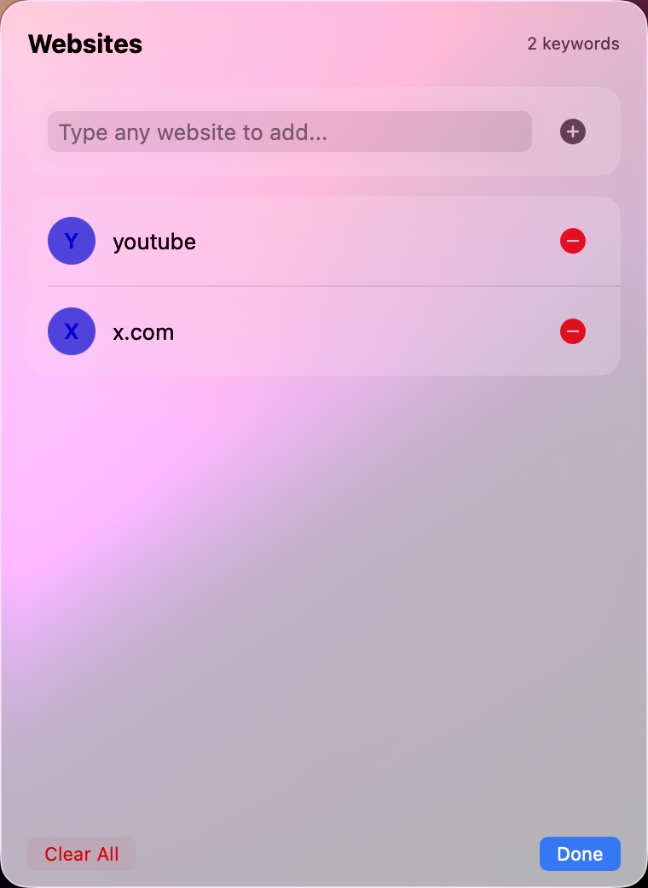

# AppJail — Block Distracting Apps & Browser Tabs on macOS

A free, open-source macOS menu bar app that blocks distracting applications and browser tabs to help you stay focused. No background polling, no network requests, no browser extensions required.

AppJail sits in your menu bar and enforces focus by terminating blocked applications and closing browser tabs that match URL keywords — all powered by native macOS APIs.

[](https://github.com/devsemih/appjail/actions/workflows/build.yml)


<p align="center">
  
  &nbsp;&nbsp;
  
</p>

## Features

- **Block Apps** — Toggle any installed application to blocked. When activated, the app is immediately terminated.
- **Block Browser Tabs** — Add URL keywords (e.g. `youtube`, `reddit`, `twitter`). Matching tabs are closed automatically — no browser extension needed.
- **Menu Bar Only** — Runs entirely from the menu bar with no dock icon. Minimal, distraction-free interface.
- **Event-Driven** — Monitors app switches via `NSWorkspace` notifications. No polling, no CPU waste.
- **Privacy-First** — No network requests, no telemetry, no tracking. Everything runs locally on your Mac.
- **Violation Alerts** — A floating panel appears briefly when a blocked app or URL is caught.
- **Persistent Block Lists** — Your block lists survive app restarts (stored in UserDefaults).

## Supported Browsers

| Browser | App Block | Tab Block |
|---------|-----------|-----------|
| Safari | Yes | Yes |
| Google Chrome | Yes | Yes |
| Microsoft Edge | Yes | Yes |
| Brave | Yes | Yes |
| Arc | Yes | Yes |
| Dia | Yes | Yes |
| Vivaldi | Yes | Yes |
| Opera | Yes | Yes |
| Firefox | Yes | No (no AppleScript support) |

## Installation

### Download

Download the latest `AppJail.dmg` from [Releases](https://github.com/devsemih/appjail/releases/latest), open it, and drag **AppJail** to your Applications folder.

The app is signed and notarized by Apple — just download, install, and run.

### Build from Source

```bash
git clone https://github.com/devsemih/appjail.git
cd appjail
xcodebuild -project appjail.xcodeproj -scheme appjail -configuration Release
```

Requires **Xcode 16+** and **macOS 15.0+**.

## Permissions

AppJail needs two permissions on first launch:

| Permission | Why |
|---|---|
| **Accessibility** | To monitor which app is frontmost and terminate blocked apps |
| **Automation** | To read browser URLs and close tabs via AppleScript |

The onboarding screen guides you through granting both. You can manage them later in **System Settings > Privacy & Security**.

## How It Works

1. AppJail observes `NSWorkspace.didActivateApplicationNotification` to detect app switches.
2. When a blocked app comes to the foreground, it calls `terminate()` on the process.
3. When a browser activates and URL keywords exist, it reads the active tab URL via AppleScript and closes the tab if a keyword matches.

No background polling. No network requests. Everything runs locally.

## Why AppJail?

Unlike browser extensions or network-level blockers, AppJail blocks both apps and browser tabs from a single native menu bar interface. Compared to tools like SelfControl, Cold Turkey, or Freedom — AppJail is lightweight, open source, and works across 8+ browsers without modifying network settings or requiring a subscription.

## Architecture

```
Models/         Data models and persistence (BlockList, AppInfo)
Services/       Core logic (MonitoringEngine, AppScanner, BrowserRegistry, AppleScript)
Views/          SwiftUI views (Dashboard, Apps tab, Browsers tab, Onboarding)
```

## License

MIT
